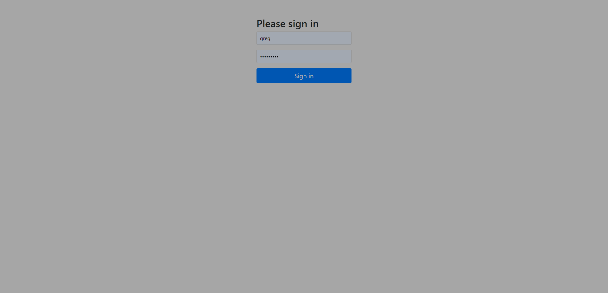
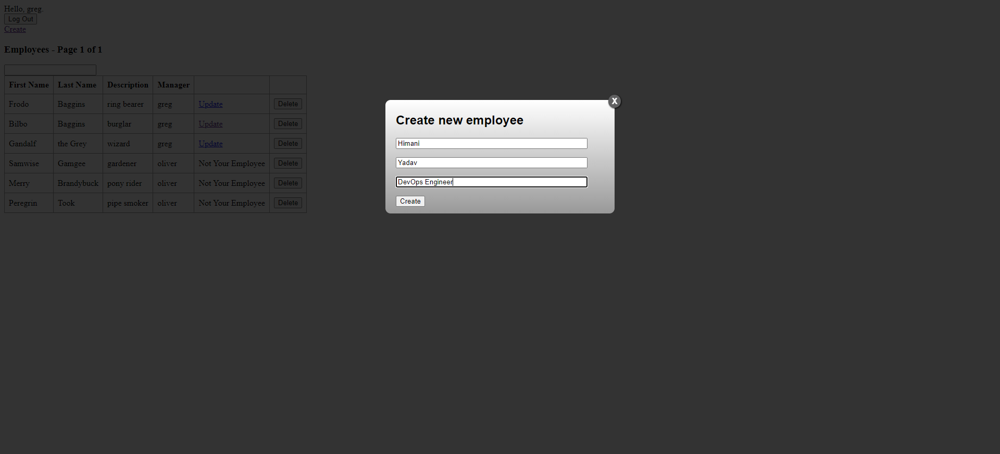
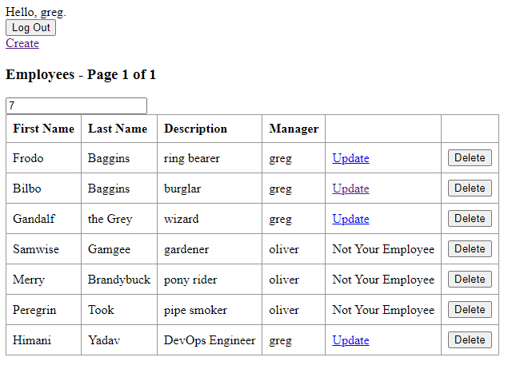

# DevOps Infrastructure Instruction for Deploying react-and-spring-data-rest

## Forking the Repository

1. Fork the Repository:
    - Go to the GitHub repository of the solution: [GitHub Repository](https://github.com/himani2203/react-and-spring-data-rest).
    - Click on the "Fork" button in the top-right corner to create a copy of the repository in your GitHub account.

## Changes made to build the Solution 

1. Converted the project folder structure into proper Sprintboot Project 
   - Some description regarding the folders
     - *models* – as name, we can keep models/domain
     - *controllers* – for keeping all controllers
     - *services* – for all services
     - *repositories* – keep all repositories
     - *configs* – configurations like WebsSocket and Sercurity.java
     - *Application.java*

2. While building the solution notice Employee class was missing default constructor.
3. Configured the Apps Insight instrumentation key in application.properties file and added dependency in pom.xml
4. Tried to implement Azure SQL connection for real database from cloud.

## Screenshot of working application

##### 1. Landing Page
   
##### 2. Create Employee Record
   
##### 3. View Employee
   
## Pre-Requisite to build the project:

1. Create a new Azure Repo from Azure Devops and push the code (https://github.com/himani2203/react-and-spring-data-rest)

2. Since i am using Terraform here to build my Infrastructure, Make sure you have a storage account and a blob container to store tf state files (Separate RG itself so that later when we cleanup our code, our state file should not be impacted and maintain Desired state).

3. Create Service Principal to run Terraform locally and from pipelines in Azure DevOps with Contributor access to Subscription. https://registry.terraform.io/providers/hashicorp/azurerm/latest/docs/guides/service_principal_client_secret#creating-a-service-principal-in-the-azure-portal

4.  Make sure you have different Subscriptions across Environments (Dev/UAT/Prod) with their respective Service principals, ACRs, Service Connection etc.

## Configuring the Solution

1. Build Application code base Image using Dockerfile for Frontend and Backend:
    - Sprinboot (https://github.com/himani2203/react-and-spring-data-rest/tree/main/backend)
    - React (https://github.com/himani2203/react-and-spring-data-rest/tree/main/frontend)
    - Application Pipelines to create (https://github.com/himani2203/react-and-spring-data-rest/tree/main/workspace/pipeline/application)

2. Once we have image we are good to deploy Infrastructure Pipelines.

3. We can also invite external or multiple personal accounts to manage our Infrastructure from Azure DevOps.
    - Refer Link : https://learn.microsoft.com/en-us/azure/devops/organizations/accounts/add-external-user?view=azure-devops

## Deploying Infrastructure

The implemented solution follows a cloud-native architecture using Infrastructure-as-Code principles. The high-level architecture includes the following components:

1. Infrastructure as Code (IaC):
    - Terraform is used as the Infrastructure-as-Code tool to provision and manage the cloud infrastructure resources.
    - Deploy the application across different environments on the target infrastructure using Infrastructure Pipeline (https://github.com/himani2203/react-and-spring-data-rest/blob/main/workspace/pipeline/infrastructure/azure-pipelines.yml)
    - Added Webhooks for continous deployments for Azure WebApps, whenever a new image is pushed to ACR.
    - Enable automatic scaling for the WebApps by configuring autoscaling rules based on your application's resource usage patterns. This will allow the infrastructure to scale up or down based on demand.

2. Access the Deployed Resources:
    - Once the deployment is complete, you can access the Web Apps direct URL to check the landing page.

## Accessing and Monitoring the Solution

1. Monitoring and Auditing:
    - Set up monitoring and auditing for the infrastructure resources using the monitoring and logging tools provided by Azure.
    - Created App-Insights to monitor data
    - Enabled diagnostic-settings to check logs if required in case of any app-service failures
